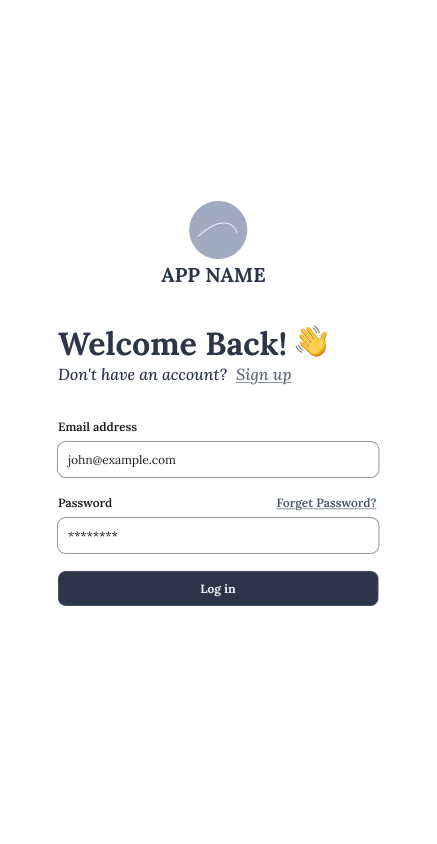
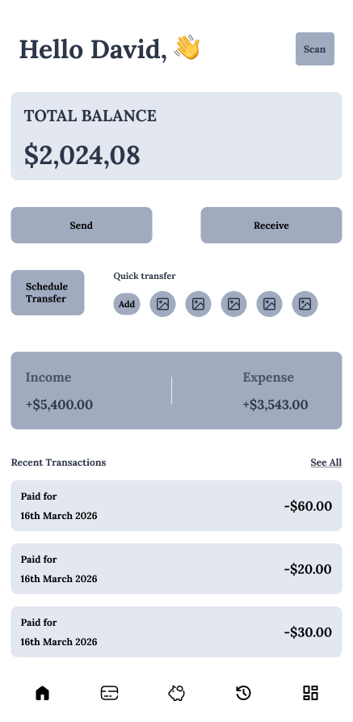
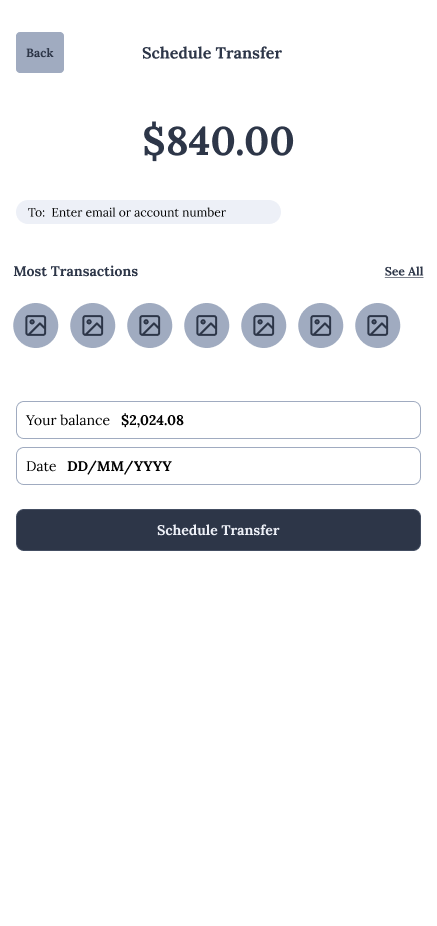
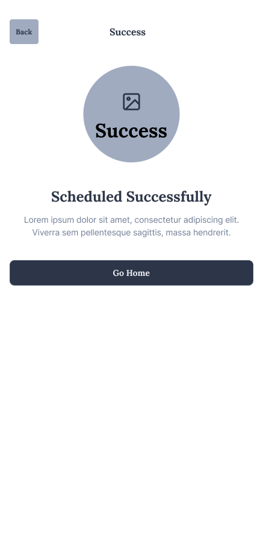

# Task 1 Wireframing & Low-Fidelity Design

CodeAlpha UI/UX Design Internship | March Batch 2026

---

## 📌 Task Brief

> Create wireframes for a mobile app or website (e.g., food delivery, e-commerce or education platform). Submit wireframes in Figma/Adobe XD.

---

## 🎯 Project Overview

This task presents low-fidelity wireframes for a **Fintech Mobile Application** a personal finance and money transfer app targeting mobile-first users. The wireframes establish the foundational information architecture, screen layout, and user flow before any visual styling is applied.

The wireframe-first approach ensures usability decisions are made independently of aesthetics, keeping the focus on structure, hierarchy, and user task completion.

---

## 📱 Screens Designed

| Screen                  | Purpose                                                           |
| ----------------------- | ----------------------------------------------------------------- |
| `Login.png`             | Entry point user authentication screen with email/password inputs |
| `Dashboard.png`         | Home screen balance overview, recent transactions, quick actions  |
| `Transfer.png`          | Money transfer initiation recipient input, amount entry           |
| `Schedule Transfer.png` | Recurring/scheduled payment configuration screen                  |
| `Success.png`           | Transaction confirmation and success feedback state               |

---

## 🖼 Screen Previews

### Login



### Dashboard



### Transfer



### Schedule Transfer


### Success



---

## 🔄 User Flow

```bash
Login → Dashboard → Transfer → Schedule Transfer → Success
```

This flow covers the core use case: a user logs in, reviews their dashboard, initiates a transfer (optionally scheduling it), and receives confirmation.

---

## 🧱 Design Decisions

- **Grayscale palette** Standard wireframe convention to avoid premature focus on color
- **Low-fidelity components** Boxes, lines, and placeholders communicate layout intent without production-level detail
- **Mobile-first layout** All screens designed at standard mobile viewport (390×844px equivalent)
- **Minimal text** Labels and dummy text indicate content regions without distracting from structure

---

## 🛠 Tool Used

- **Figma**

---

## 🔗 LinkedIn Post

<https://www.linkedin.com/posts/simon-emmanuel_uiux-fintech-productdesign-activity-7440588839796187136-xXxF>

---

## 📂 Files in This Folder

```bash
Task1-Wireframes/
├── Login.png
├── Dashboard.png
├── Transfer.png
├── Schedule Transfer.png
└── Success.png
```
