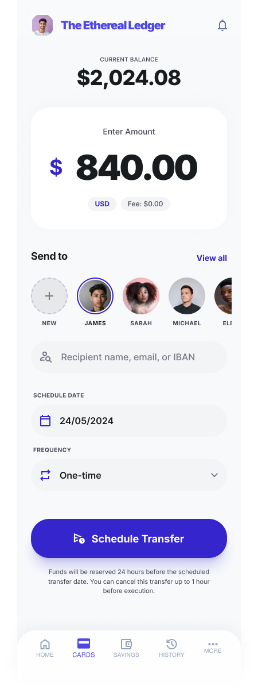
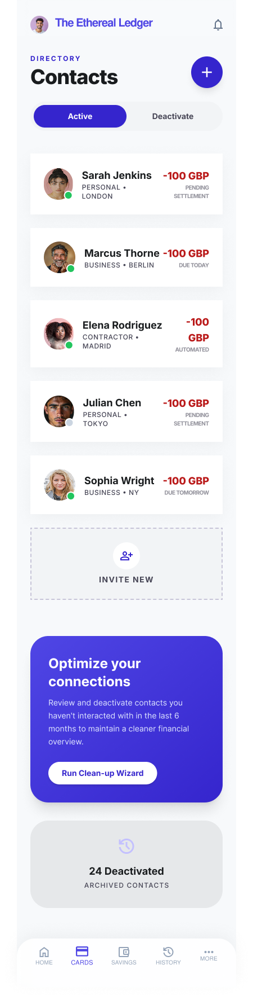
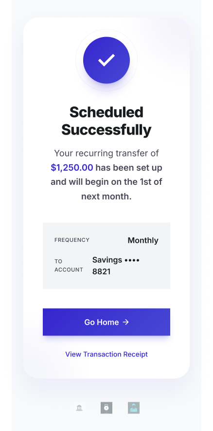

# Task 2 High-Fidelity UI Design

CodeAlpha UI/UX Design Internship | March Batch

---

## 📌 Task Brief

> Convert the wireframe into a high-fidelity UI design. Add color palettes, typography, buttons, icons, and images. Ensure the design follows UI/UX principles.

---

## 🎯 Project Overview

This task is the visual evolution of Task 1's wireframes. The same **Fintech Mobile Application** has been converted into a fully styled, production-ready high-fidelity UI. Every screen has been elevated with a cohesive design system complete with color, typography, iconography, and interactive component states.

The goal was to build a UI that feels trustworthy and modern, consistent with what users expect from a premium financial product.

---

## 📱 Screens Designed

| Screen             | Purpose                                                                            |
| ------------------ | ---------------------------------------------------------------------------------- |
| `Login Screen.png` | Polished authentication screen with branded visuals, styled inputs, and CTA button |
| `Dashboard.png`    | Main hub balance card, transaction history list, quick action shortcuts            |
| `Transfer.png`     | Transfer flow recipient selector, amount field with currency formatting            |
| `Success.png`      | Transaction confirmed state success illustration, amount summary, action CTAs      |
| `Contacts.png`     | Recipient selection screen contact list with search and recent recipients          |

---

## 🖼 Screen Previews

### Login Screen


### Dashboard


### Transfer



### Contacts



### Success



---

## 🎨 Design System

### Color Palette

The UI uses a dark-themed financial aesthetic designed to convey security and modernity:

- **Primary Accent** High-contrast action color used on buttons and highlights
- **Background** Deep dark surface for reduced eye strain
- **Card Surface** Slightly elevated dark tone for layered depth
- **Primary Text** White for strong legibility on dark backgrounds
- **Secondary Text** Muted gray for metadata and supporting labels

### Typography

- Bold, heavy weights for balance amounts and key data points
- Regular weight for labels and supporting content
- Consistent type scale maintaining clear visual hierarchy across all screens

### Components

- Fully rounded pill-style primary buttons
- Dark input fields with clearly visible borders and ghost placeholder text
- Card components with soft shadows for elevation
- Icon-led quick action tiles on the dashboard

---

## ✅ UI/UX Principles Applied

- **Visual Hierarchy** Amount figures and key actions are immediately dominant
- **Consistency** Uniform spacing, corner radius, and component styling across all screens
- **Feedback States** The Success screen provides clear positive reinforcement after task completion
- **Accessibility** High contrast ratio between text and backgrounds throughout
- **Mobile Ergonomics** Touch targets sized for comfortable one-handed use

---

## 🛠 Tool Used

- **Figma**

---

## 🔗 LinkedIn Post

<https://www.linkedin.com/posts/simon-emmanuel_uidesign-uxdesign-codealpha-activity-7444493293947731968-hXZv>

---

## 📂 Files in This Folder

```bash
Task2-HiFi-UI/
├── Login Screen.png
├── Dashboard.png
├── Transfer.png
├── Success.png
└── Contacts.png
```
