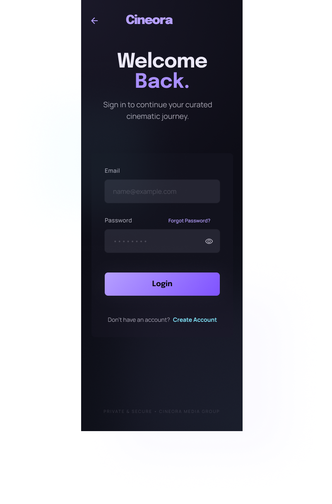

# Task 4 Mini Project: Prototype Design

CodeAlpha UI/UX Design Internship | March Batch

---

## 📌 Task Brief

> Create a clickable prototype of a complete app or website using Figma/Adobe XD. Submit prototype link + 2–3 page design explanation.

---

## 🎬 Project: Cineora

**Your African Cinema, Unlimited.**

Cineora is a high-fidelity, fully clickable mobile streaming prototype designed for the African market specifically targeting young Nigerian users (18–35) who want affordable, mobile-first access to Nollywood and pan-African cinema.

### The Problem

Global platforms like Netflix are expensive and carry limited African content. Cineora addresses this gap with NGN-denominated subscription pricing, a dark cinematic UI, and a content-forward experience optimized for Nigerian smartphones.

---

## 🔗 Prototype Link

**▶️ View Interactive Prototype:** <https://bit.ly/4msOkVs>

---

## 🎨 Design System

### Color Palette

| Token          | Hex       | Usage                                |
| -------------- | --------- | ------------------------------------ |
| Primary Purple | `#7C3AED` | Buttons, active states, highlights   |
| Background     | `#0D0D1A` | App background                       |
| Card Surface   | `#12122A` | Content cards and panels             |
| Primary Text   | `#FFFFFF` | Headings and key labels              |
| Secondary Text | `#A0A0B0` | Metadata, descriptions, placeholders |

### Typography

- **Headings** Bold white, strong visual hierarchy
- **Body / Metadata** Gray (`#A0A0B0`), system sans-serif for cross-platform consistency
- **Buttons** Fully rounded purple pill style

---

## 📱 Screen Architecture

### User Flow

```bash
Splash → Sign Up / Login → Home → Content Detail → Video Player
                                → Search → Content Detail
                                → Profile → Subscription Plans
```

### Screen Inventory

| Screen                    | File                            | Purpose                                                              |
| ------------------------- | ------------------------------- | -------------------------------------------------------------------- |
| Splash Screen             | `Splash Screen.png`             | Brand entry logo, tagline, Get Started CTA                           |
| Sign Up                   | `Sign up.png`                   | New user registration name, email, password                          |
| Login                     | `Login.png`                     | Returning user sign-in with Forgot Password link                     |
| Home Screen               | `Home Screen.png`               | Content hub hero banner, Trending in Nigeria, Continue Watching rows |
| Premium Cinematic Search  | `Premium Cinematic Search.png`  | Genre grid + search input                                            |
| Content Detail            | `Content Detail.png`            | Title page metadata, Play & My List CTAs, cast, similar titles       |
| Video Player with Details | `Video Player with Details.png` | Full-screen landscape player with seek bar and controls              |
| Subscription Plans        | `Subscription Plans.png`        | 3 NGN-priced tiers Basic ₦1,500 / Standard ₦2,500 / Premium ₦4,000   |
| Profile Screen            | `Profile Screen.png`            | Account settings Edit Profile, Manage Subscription, Log Out          |

---

## 🖼 Screen Previews

### Splash Screen


### Sign Up


### Login



### Home Screen


### Premium Cinematic Search


### Content Detail


### Video Player


### Subscription Plans


### Profile Screen


---

## 💡 Key UX Decisions

**Mobile-First (390×844px)**
Optimized for the most common Nigerian smartphone screen size with generously sized touch targets throughout.

**NGN Pricing**
Displaying prices in Naira removes the mental friction of currency conversion, improving conversion rates on the subscription screen.

**Consistent Bottom Navigation**
Fixed bottom navbar (Home, Search, My List, Profile) on all applicable screens reduces cognitive load. Users always know where they are.

**Dark Theme**
Reduces eye strain during night-time viewing when streaming consumption peaks and creates an immersive cinematic atmosphere.

**Figma Prototype Interactions**
Every button, card, and nav icon has a clear hotspot mapped to its destination screen for a seamless, fully demoable clickable flow.

---

## 📎 Full Design Explanation

The complete 2-page design write-up covering design system, screen architecture, UX rationale, and prototype structure is available in:

📄 `Cineora_Design_Explanation.docx`

---

## 🛠 Tool Used

- **Figma** UI design, component library, prototyping & interactions

---

## 🔗 Links

- **Prototype:** <https://bit.ly/4msOkVs>
- **LinkedIn Post:** <https://www.linkedin.com/posts/simon-emmanuel_uiuxdesign-figma-codealpha-activity-7449497895566884864-BgN8>

---

## 📂 Files in This Folder

```bash
Task4-Prototype/
├── Cineora_Design_Explanation.docx
├── Splash Screen.png
├── Sign up.png
├── Login.png
├── Home Screen.png
├── Premium Cinematic Search.png
├── Content Detail.png
├── Video Player with Details.png
├── Subscription Plans.png
└── Profile Screen.png
```
